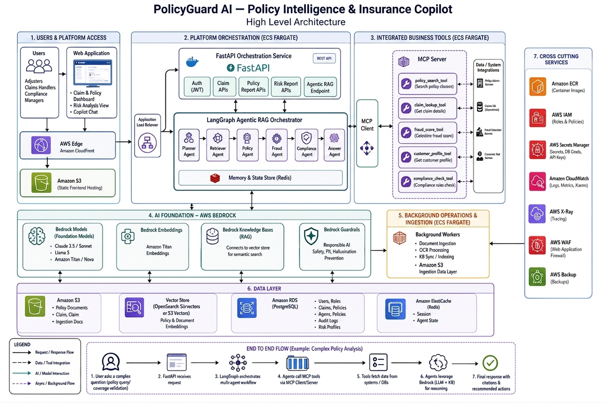

# PolicyGuard AI Agent

An autonomous Agentic RAG workflow engine dedicated to processing and validating insurance claims. This service utilizes AWS Bedrock, LangGraph-inspired multi-agent orchestration, and Model Context Protocol (MCP) servers to execute specialized backend tools.

## System Architecture



In the broader infrastructure ecosystem, this microservice acts as the primary **Agentic RAG Orchestrator** and **MCP Client**. It is responsible for driving the event-driven workflow, relying on **AWS Bedrock** for cognitive reasoning while connecting to the MCP server to trigger necessary claim, policy, and fraud-detection tools.

### Coverage-check workflow

```text
POST /api/v1/workflow/coverage-check
  -> Planner Agent (Determines the execution sequence)
  -> Policy Agent (Retrieves relevant clauses via the MCP server)
  -> Fraud Agent (Computes risk/fraud scoring via the MCP server)
  -> Answer Agent (Synthesizes the final coverage decision)
```

## Local Development

```bash
pip install -e ".[dev]"            # Installs core dependencies + DSPy
# Optional: Enable parsing for PDF/DOCX policy files
pip install -e ".[dev,docling]"

make run        # Boots the orchestrator on port 9020
make test       # Executes tests
make lint       # Triggers code formatting and linting
```
Note: This service depends on the policyguard-ai-mcp-server running concurrently on port 8001.

## Environment Variables

Copy the `env.example` to `.env`:

```
ENVIRONMENT=dev
AWS_REGION=us-east-1
BEDROCK_MODEL_ID=anthropic.claude-3-5-sonnet-20240620-v1:0
MCP_SERVER_URL=http://localhost:8001
```

### Document Parsing (Docling)

When `DOCLING_ENABLED=true` is configured, the Policy Agent utilizes [Docling](https://github.com/docling-project/docling) to ingest local files (PDF/DOCX) specified by `policy_document_path`. It extracts and attaches the parsed markdown to the clauses retrieved via MCP. You can limit the extraction size using `DOCLING_MAX_CHARS`.

### AWS Bedrock Reasoning (DSPy)

If `DSPY_BEDROCK_ENABLED=true` is set, the Answer Agent executes a **DSPy** `ChainOfThought` process. This leverages **Amazon Bedrock** (routed through LiteLLM) to evaluate the combined fraud and policy context. Valid AWS credentials with `bedrock:InvokeModel` permissions are required. Should the Bedrock invocation fail, the system defaults to basic keyword-matching heuristics.

API Usage: You can pass a `policy_document_path` in the payload for `POST /api/v1/workflow/coverage-check` to utilize Docling dynamically.

## LLM Gateway (LiteLLM)

We pin **`litellm`** as a core production dependency alongside **DSPy**. For direct `chat_completion` requests targeting Bedrock, import ```policyguard_ai_agent.llm.litellm_client```. You can override the default model by configuring the ``LITELLM_MODEL_ID`` environment variable.

## Offline Evaluation (Ragas & DeepEval)

To run evaluations locally or in your CI/CD pipelines, install the evaluation packages (AWS Bedrock credentials are required by default):

```bash
make install-eval
make eval-ragas      # Evaluates Context Recall, Faithfulness, and Factual Correctness
make eval-deepeval   # Evaluates Answer Relevancy and Faithfulness against golden datasets
```

Benchmark data is located in ``eval/golden_samples.jsonl``. To change the evaluator model, update the ``EVAL_LLM_MODEL=bedrock/...`` variable.

To trigger evaluation tests via pytest (invokes Bedrock):

```bash
RUN_EVAL_TESTS=1 pytest tests/eval/ -v -m eval
```

## Containerization (Docker)

Building the Docker image requires a Personal Access Token (PAT) passed as a build argument to successfully fetch private repository dependencies (see `Makefile` / `.env`).

```bash
docker build --build-arg GITHUB_TOKEN="$GITHUB_TOKEN" -t policyguard-ai-agent .
docker run -p 9020:9020 --env-file .env policyguard-ai-agent
```

## Version Control

This repository follows Calendar Versioning (CalVer): `YYYY.MM.PATCH`

## Maintainer & Governance

**Ebubechukwu Onwudiegwu**  

This repository serves as the core orchestration engine for the **PolicyGuard AI** enterprise platform.

- **Email:** [eonwudiegwu@gmail.com](mailto:eonwudiegwu@gmail.com)

For infrastructure queries, code reviews, or security vulnerability disclosures regarding this microservice, please contact the maintainer directly.
